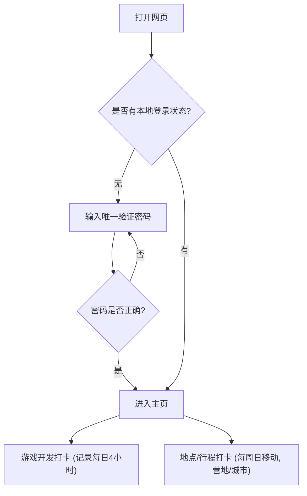

## 1. 产品概述
为期一年的全国“床车游+独立游戏开发”记录追踪Web应用。
主要解决在驾驶别克E5纯电车（续航400公里）、每周按季节向舒适气候区迁徙的过程中，记录沿途人文地理位置打卡，以及每日4小时独立游戏开发进度打卡的需求。网页支持移动端访问，提供简易的单密码身份验证（无需数据库）。

## 2. 核心功能

### 2.1 角色权限
| 角色 | 注册方式 | 核心权限 |
|------|----------|----------|
| 创作者 | 统一预设密码验证 | 查看计划、进行地点打卡与游戏开发打卡 |

### 2.2 功能模块
1. **认证页**：单密码输入验证
2. **仪表盘主页**：当前季节/气候提示、本周行驶目标（400公里/周日）、打卡状态
3. **打卡记录模块**：地理位置打卡（城市/营地住宿）、游戏开发时长打卡（每日4小时）
4. **行程规划模块**：从上海出发（6月起）的一年期季节性迁徙路线预览

### 2.3 页面详情
| 页面名称 | 模块名称 | 功能描述 |
|----------|----------|----------|
| 认证页 | 密码表单 | 简单的密码输入框，验证通过后写入本地缓存 |
| 主页 | 状态概览 | 显示当前所处城市、季节、剩余电量预估或每周里程目标进度 |
| 主页 | 游戏打卡 | 点击记录当天的开发时长（目标4小时，下午或晚上） |
| 主页 | 地点打卡 | 记录新到达的地点、人文见闻、是否为营地/城市停车 |

## 3. 核心流程
用户打开网页进行密码验证，通过后进入主页，可以查看当前的旅行进度和开发进度，并进行每日的开发打卡或每周的地点打卡。

## 4. 界面设计
### 4.1 设计风格
- **主次颜色**：自然人文风，使用大地色系（如森林绿、原木色、暖沙色），体现舒适气候和自然迁徙的旅行感。
- **按钮样式**：圆角卡片设计，带有轻微的阴影质感（扁平化带轻拟物）。
- **字体大小**：清晰易读的无衬线字体，标题偏大，适合户外阳光下查看。
- **布局风格**：移动端优先的单栏流式卡片布局，大区块触摸友好。
- **图标建议**：使用旅行（车辆、帐篷、地图）和开发（代码、控制器、咖啡）相关的直观图标。

### 4.2 页面设计概览
| 页面名称 | 模块名称 | UI元素 |
|----------|----------|--------|
| 认证页 | 登录框 | 简约背景，大号输入框，全宽登录按钮 |
| 主页 | 进度卡片 | 环形进度条（展示开发时间/行驶里程），醒目的打卡按钮 |
| 主页 | 历史记录列表 | 时间轴样式的卡片列表，展示人文足迹和开发日志 |

### 4.3 响应式要求
移动端优先设计，适配各类手机屏幕（Touch 优化，大按钮），桌面端采用居中限制宽度的卡片布局。
