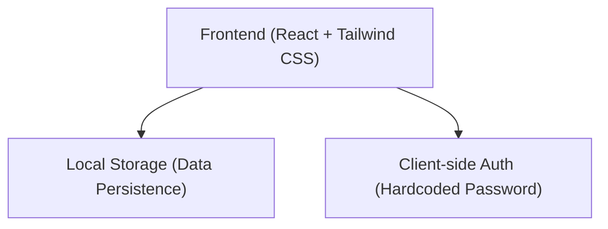
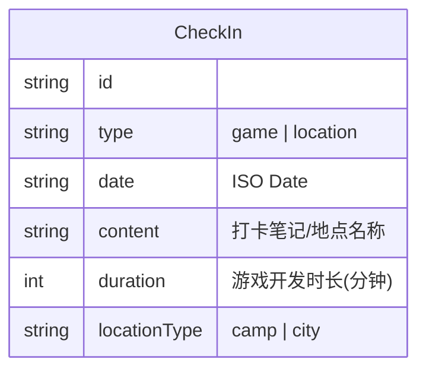

## 1. 架构设计


## 2. 技术描述
- **前端框架**: React@18 + tailwindcss@3 + vite
- **状态管理**: React Hooks (useState, useEffect, useContext) + localStorage
- **图标库**: Lucide React
- **路由管理**: 简单的条件渲染，无复杂路由。
- **部署方案**: 纯静态前端，无需后端服务器与数据库，可部署于 Vercel、Netlify 或 GitHub Pages。

## 3. 路由定义
| 路由 | 用途 |
|-------|---------|
| `/` | 默认路由，根据登录状态条件渲染密码登录组件或打卡主页组件 |

## 4. API 定义
无后端 API。数据存储均调用浏览器 `localStorage` API。

## 5. 数据模型
### 5.1 数据模型定义


### 5.2 数据定义语言
由于无后端，使用 TypeScript 接口定义数据结构：
```typescript
interface CheckInRecord {
  id: string;
  type: 'game' | 'location';
  timestamp: number;
  content: string; // 笔记内容或人文见闻
  
  // 对于游戏打卡
  durationMinutes?: number; 
  
  // 对于地点打卡
  locationName?: string;
  locationType?: 'camp' | 'city';
}
```
